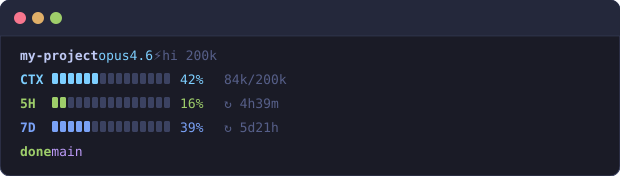
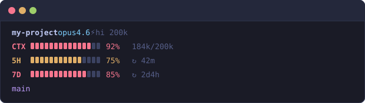

# Claude Code Statusline

A terminal statusline for [Claude Code](https://docs.anthropic.com/en/docs/claude-code) that displays context window usage, 5-hour/7-day token quotas, model info, and git branch — all in real time.

<p align="center">
  
</p>

Colors shift automatically when usage gets high:

<p align="center">
  
</p>

## Install

```bash
# 1. Clone
git clone https://github.com/jojo-dan/claude-code-statusline.git ~/.claude/statusline

# 2. Add to ~/.claude/settings.json
# {
#   "statusLine": {
#     "command": "bash ~/.claude/statusline/scripts/statusline.sh"
#   }
# }

# 3. Restart Claude Code
```

The 5H/7D quota bars automatically detect your Claude Code login credentials — no extra setup needed.

## Features

- **CTX** — Context window usage bar (color-coded: cyan → yellow → red)
- **5H / 7D** — 5-hour / 7-day token quota bars with reset countdown
- **Model** — Current model (opus4.6, sonnet4.6, haiku4.5, etc.)
- **Branch + Phase** — Git branch + optional project phase
- **Responsive** — Auto-adapts to terminal width (L / M / S)
- **Toggleable** — Enable/disable individual rows via settings.json

## Configuration

### Toggle rows

Add a `statusline` object to `~/.claude/settings.json`. Omitted keys default to `true`.

| Key | Row | Default |
|-----|-----|---------|
| `statusline.ctx` | CTX bar | `true` |
| `statusline.5h` | 5H quota bar | `true` |
| `statusline.7d` | 7D quota bar | `true` |
| `statusline.branch` | Branch + phase | `true` |

```json
{
  "statusline": {
    "5h": false,
    "7d": false
  }
}
```

### Environment variables

| Variable | Description |
|----------|-------------|
| `CLAUDE_STATUSLINE_OFF=1` | Disable statusline for the session |
| `CLAUDE_OAUTH_TOKEN` | Manual OAuth token fallback (when credential store is unavailable) |

## How it works

**statusline.sh** reads the JSON that Claude Code pipes to stdin, parses context/model/workspace data, and prints formatted output to the statusline area.

**fetch-usage.sh** runs in the background, reads your OAuth token from the OS credential store (macOS Keychain / Linux libsecret), and calls the Anthropic usage API. Results are cached at `/tmp/claude-usage-cache.json` (TTL 120s) so the statusline never blocks.

## Requirements

- `bash`, `jq`, `python3`, `curl`, `git`
- macOS: `security` (pre-installed)
- Linux: `secret-tool` (optional — falls back to `CLAUDE_OAUTH_TOKEN` env var)

## Visual guide

For an interactive walkthrough with live previews, open the [setup guide](https://jojo-dan.github.io/claude-code-statusline/guide.html).

## License

MIT
